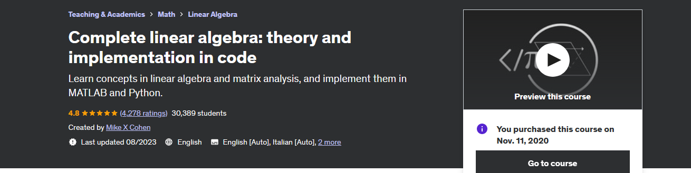

## Complete linear algebra: theory and implementation in code



Learn concepts in linear algebra and matrix analysis, and implement them in MATLAB and Python. Personally I use this to have more hands-on experience with some abstract concepts at school

Boosting my knowledge to up to speed. This contains exercise files and my own notes alongside with them.<br/>

All course material from Complete linear algebra: theory and implementation in code by Mike X Cohen

If the content sparked 🔥 your interest, please consider buying the course and start learning 📖

Author's sites:

[The Course at Udemy](https://www.udemy.com/course/linear-algebra-theory-and-implementation/)   
[Mikexcohen](https://mikexcohen.com/)   
[Sincxpress](https://sincxpress.com/)   


Insert certificate here when completed

**Note: The material provided in this repository is only for helping those who may get stuck at any point of time in the course. It is very advised that no one should just copy the solutions(violation of Honor Code) presented here.**


## Progress
- [ ] Section 01 - 
- [ ] Section 02 - 
- [ ] [Section 03](https://github.com/developersCradle/complete-linear-algebra-theory-and-implementation-code/tree/main/Section%203)  - Vectors
- [ ] Section 04 -
- [ ] Section 05 -
- [ ] [Section 06](https://github.com/developersCradle/complete-linear-algebra-theory-and-implementation-code/tree/main/Section%206) 
- [ ] Section 07 -
- [ ] Section 08 -
- [ ] Section 09 -
- [ ] Section 10 -
- [ ] Section 11 -
- [ ] Section 12 -
- [ ] Section 13 -
- [ ] Section 14 -
- [ ] Section 15 -
- [ ] Section 16 -


- todo Matrix rank ja esimerkki
- todo more when time

- Todo katso noi tehtävät pythonilla ja mathlabilla
- todo lissää quizzes??? pohdi
- todo toi .csCode tarpeellinen?
- todo check if notes to cloud would be better? From some student

You can also use the Nbviewer Online page to view the notebook:

```
https://nbviewer.jupyter.org/

https://nbviewer.org/github/Johnstul/Mike-X-Cohen-Complete-Linear-Algebra-Notes/blob/master/mike_x_lin_alg_Chapter2_2a.ipynb
```