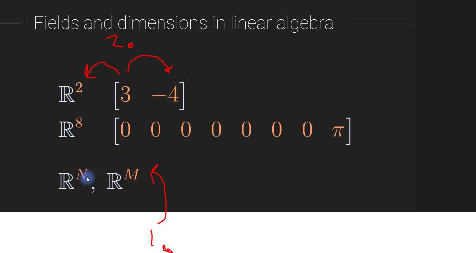
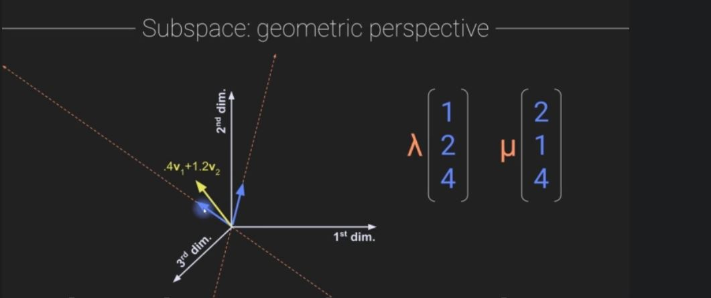
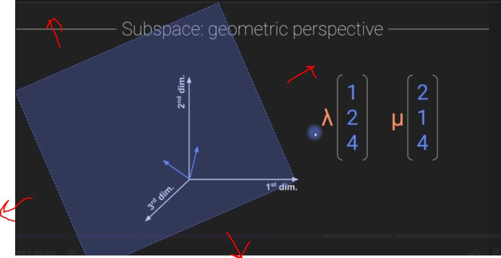
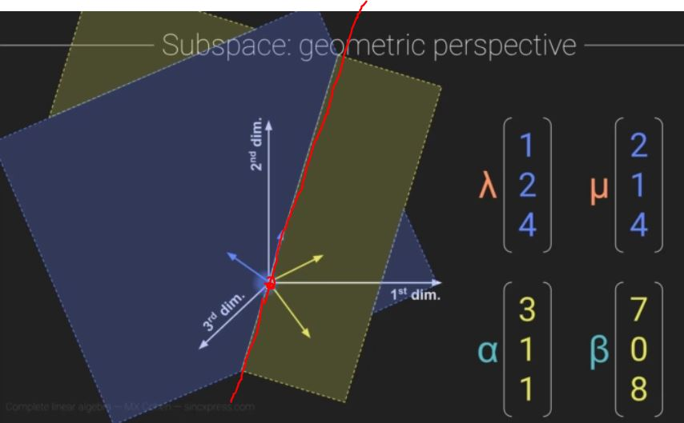
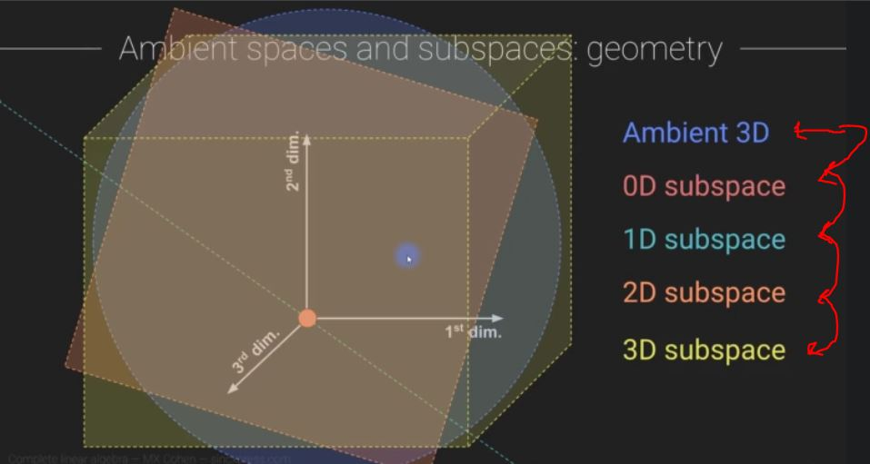
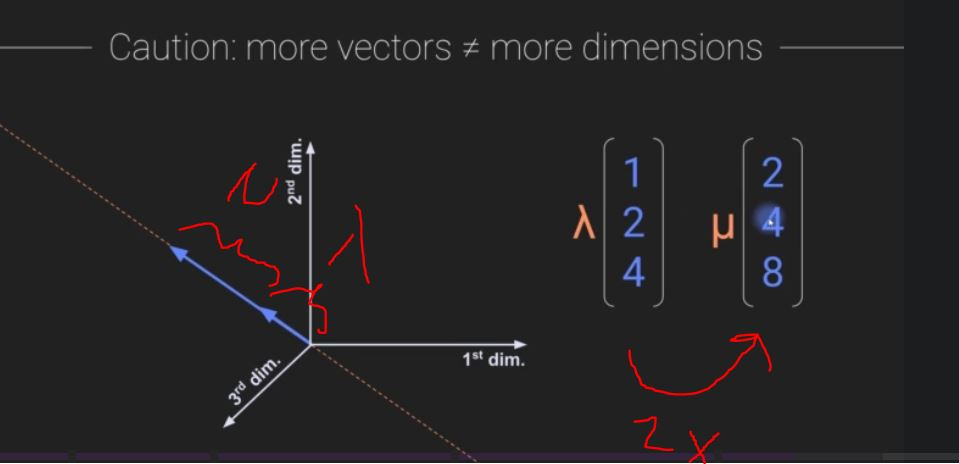

# Section 3: Vectors

Vectors

# What I Learned

### Chapter 25. Dimension

- Dimensions, are numbers of elements in vector
    - Idea, each dimension provides some information about the vector

- dimensional = ulottuvuus

- This is still 3-dimensional vector, even if it's only pointing to one direction
    - This is **1-dimentional** subspace embedded in 3-dimension

- Field in mathematics 

- Fields are often described as such   
    - 2. this vector lives in field of two real number dimensionality

### Chapter 26. Subspaces

- Subspace is defined by taking linear combinations of some vector, or scalar
    - 1. These are in same **subspace**, V can be expressed with scalar and V
    - 2. Not the same vector as original one, in **1.**, but in  same **subspace**

- Linear Combination of two vectors also make **subspace**
    - Linear Combination means scalar multiplication and addition

- 1. These are not in same **subspace** since V multiplied any scalar cannot become any vector in red.

- **Closed under** means, "done inside subspace needs to stay in subspace"
    - 1. Same in math notation.
        - (todo heikki palaa tähän kun saa M11 kirjam luettua)

- 1. Vector * by scalar defines line **subspace**
    - All points in this line are subspaces of this

- These two make now own subspace, they make 2-dimensional plane

- Now these two vectors make subspace which stretches infinity to all directions

- These two planes are in own subspaces, they meet in line and in origo
    - These vectors are not the same

- Inside 3d ambient space there are/can be many subspaces

- Two vectors not always create plane, these two vectors are not independent of each other. 
    - These also apply to space

- 1. All elements zero, is **0-dimension subspace** of **R^5**
- 3. 2-dimensional subspace inside R^5. This form plane
    - These two vectors are separate
- 4. In 3-dimensions subspace inside R^5

- These are still subspaces since they don't fill whole ambient space

### Chapter 27. Subspaces vs. subsets

- todo 

### Chapter 28. Span

- **Span** is almost like **subspace**
    - Used slightly different in concepts
        - Subspace is reached by linear combination of vectors
            - Those vectors **Spans** that subspace

- Is 1 or 2 **Span** of set **S**, yes if we can produce **V** or **W** using set of **S**
    - 1. Yes, 1 can be expressed using set of **S**
    - 2. Can we produce **W** with any set of **S**, no since there is zeros
    - 3. There are computations to figure out these weights

- As you can see **W**(in blue) is not in same span as, pointing up **S**, but **V**(in black) is in span of set **S**(in red)

- These two can **span** all in this R^2

- 1. We can express this **blue arrow** in first pic using different spaning sets
    - 1. Example using last **spaning set in yellow** 1. we need such coefficients
    - 2. and same with 2. In blue
    - This show some vector set are more insightful to illustrate some vectors, **bases**

### Chapter 29. Linear independence

- We can write **W2** as scaled version of **W1**

- Second example **V2** can be expressed as linear combination of **V1** and **V2**

- Now we can say that these two sets **{W1,W2} and {V1,V2,V3}** are linearly dependent sets
    - Linear dependent is property for **set of vectors**, not property of vector in a set!

- **W1** and **W2** cannot be expressed as itself with scalar, therefore they are **Linearly independent set**
- **?** Not always easy see is the set of vectors **linearly independent**
    - There are techniques to figure this one out

- 1. if 0, this is linearly independent set

- 1. Example, we can express othere vector with multiple of other vector > **Dependent set**
- 2. Example, no scalar can change others vectors direction > **Independent set**
    - Expect, if both **0 vectors**, this is trivial, so we ignore this
- 3. **Dependent set**, we are in **R^2**, and we just need figure out combination of blue and yellow to express the white vector
    - Just need two vectors to reach any point in **R^2**

- If vector point direction where combination of two cannot reach, **Independent set**

 

- **REMEMEBER** independent/dependence describes **set of vectors** not independent vector in that set

- Just remember this theorem
    - 1. If more vectors than dimensions, necessarily **dependent set**
    - 2. Could be independent set, see picture 3rd picture from beginning with two vectors for reference

- 1. 4 vectors in r^3 space, set must be **dependent**

- 2. If zeros there is **zero-vector**, any time zero will be zero vector. **Linearly dependent**

### Chapter 30. Basis

- TODO tee tämä

## Some additional sources

- [Span,Basis](https://www.youtube.com/watch?v=k7RM-ot2NWY&list=PLe8LZCtW06l8D07uNbguVY8T4rlGmdymY&index=4)