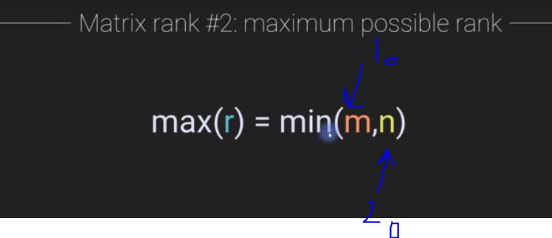
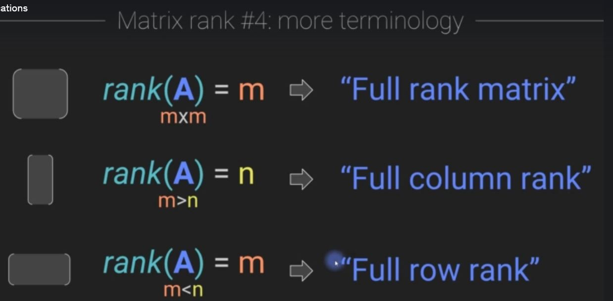
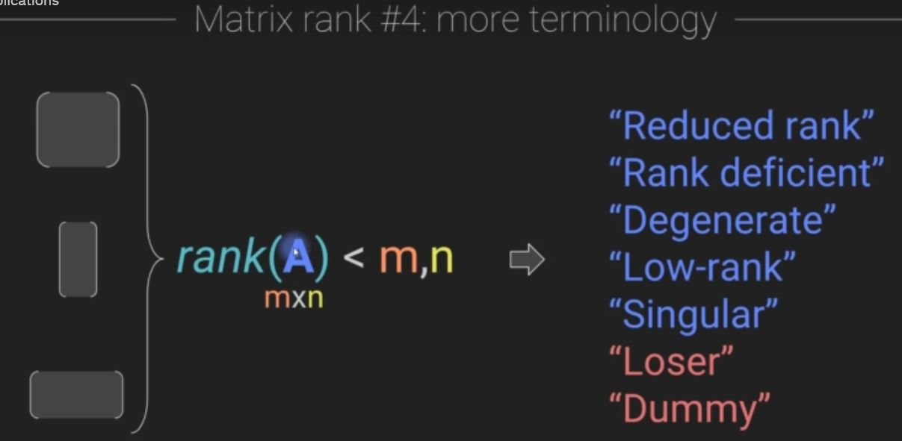
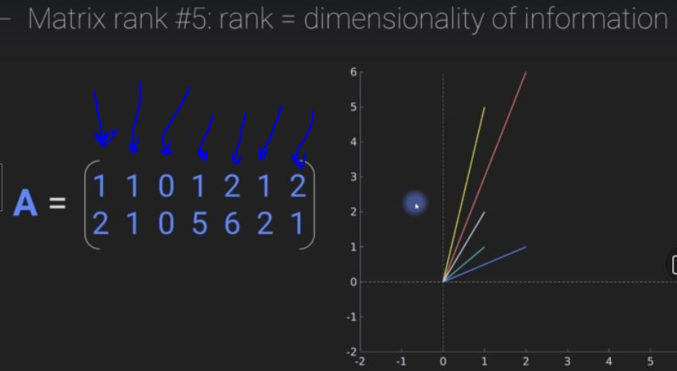
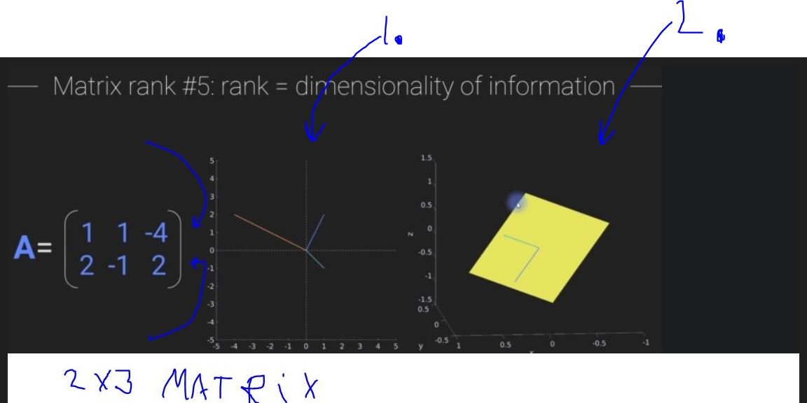
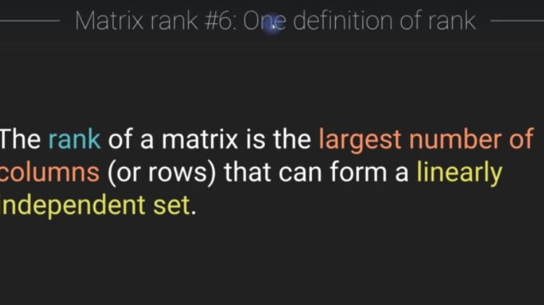
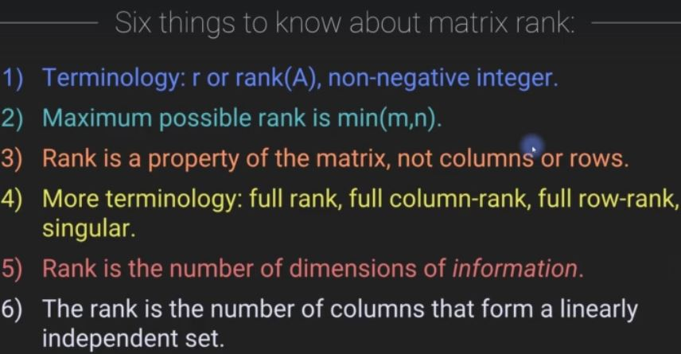

# Section 6: Matrix rank

Matrix rank 

# What I Learned

### Chapter 62. Rank: concept, terms, and application

- Terminology `r` or `rank(A)`
    - Non-negative integer (0,1,2,3 ...) 
        - Connected to dimensionality of information contained in matrix

- Finding maximum possible rank, is to count of 1. **rows** and 2.**columns** and then take smaller of those two 
    - It cannot be larger than maximum r, it can only be smaller

- **Rank** tai aste
- **Rank** is concept of whole matrix, not connected to specific **columns** of matrix or **rows** of matrix
    - `rank(C(A))` does not exist
    - `rank(R(A))`
    does not exist
        - Instead use `rank(A)`, one rank of matrix!

- Some terminology

- Geometrically speaking, plotting each column as vector into 2d plane. We can see that other columns are not providing any additional unique information, so **RANK** is **two**
    - We could express all these point using **two** vectors

- We can plot this 2x3 matrix in 2-dimensional plane as seen in **1.**

- Plotting this into **R^3**
    - **Rank** could be different if we plot this using rows, not the case, but want to illustrate
- As you can see from point **2.** Plane plotted in 3-dimension as such. It's still **2-dimensional subspace** plane inside 3-dimensions
    - This would still give us **Rank** of two, coz its property of an matrix

- Summary of rank

- Matrix Rank has some applications
    - Can be used if matrix has inverse
        - Only full rank matrices has inverse
    - Used also many other places, such as vector analysis
        - Used to determine how much information is contained in multivariant dataset
        - Data compression and so on

### Chapter 63. Computing rank: theory and practice

## Some additional sources

- [Rank](https://www.youtube.com/watch?v=uQhTuRlWMxw)
