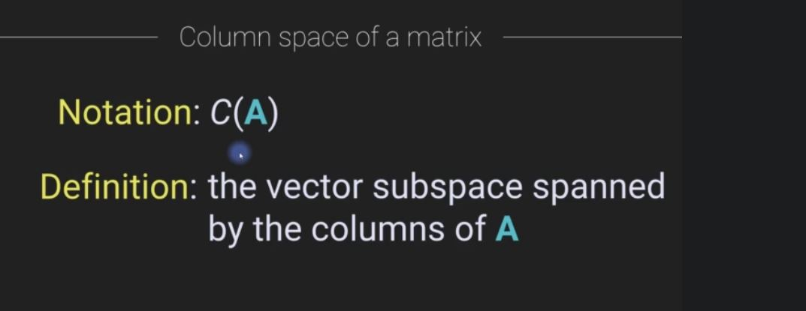
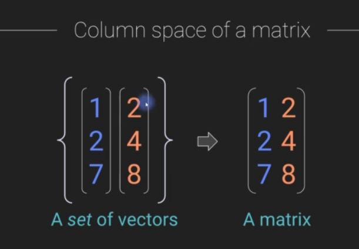
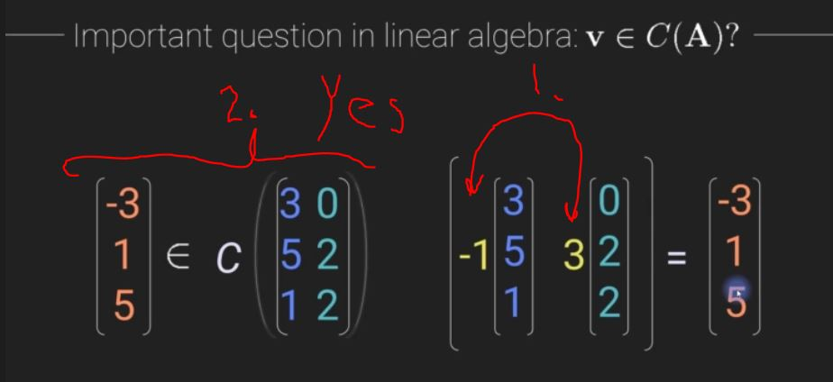

# Section 7: Matrix spaces

Matrix spaces

# What I Learned

### Chapter 72. Column space of a matrix

- **C** column

- 1. Own object**s**
- 2. Own object! 

 TOdo jäin 4:00

## Some additional sources

- [column space and null space](https://www.youtube.com/watch?v=uQhTuRlWMxw&list=PLZHQObOWTQDPD3MizzM2xVFitgF8hE_ab&index=7)
