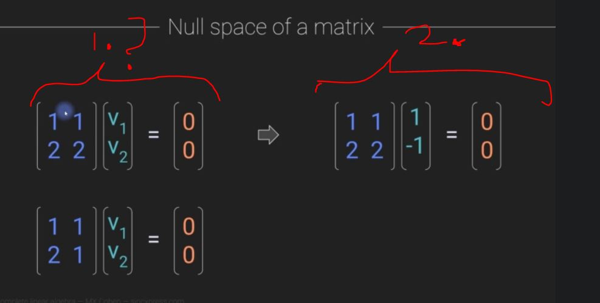
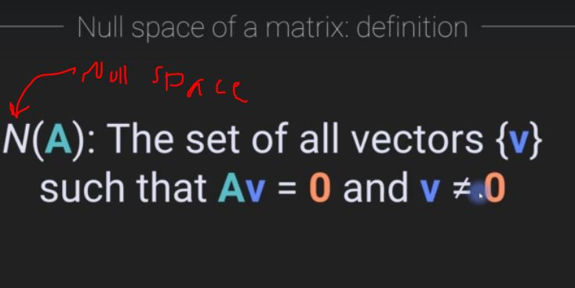

# Section 7: Matrix spaces

Matrix spaces

# What I Learned

### Chapter 72. Column space of a matrix

- **C** column

- 1. Own object**s**
    - In matrix, every object its itself
- 2. Own object! 

- Official definition for Column Space
    - 1. Set of all vectors which can be retrieved from matrix

- Is given vector in column space of this matrix. **2.**
    - 1. With following weighted scalars

- Zero vector is also included in **Column space** of this matrix

- 2. Here you can see plane which does not contain vector A in **Column Space**
    - 1. Geometric illustration as vector pointing out of the plane. Hence, **NOT** not contained in **Column Space** of matrix

    Todo heikki 5:00

### Chapter 75. Null space and left null space of a matrix

- Idea is to get matrix zero, with not zero matrix. Let's look first this thought scalars

- 1. Idea is to have scalar that makes this equation into zero

- 1. With vectors/matrices can we find such combination of **v1** where result is zero-vector
    - This **cannot** be zero vector
        - Answer is yes, **2.**
- 3. We cannot find such vector which makes this equation zero.
    - Zero vector not allowed
    - We say, this matrix does **not** have **null space**

- Official definition goes like such
    - `A:n nulliteetti (nollaantumisluku) on dim N(A).`

- Null space is not just one vector, its is entire subspace

- 1. We use scalar with base vector to present null space

## Some additional sources

- [column space and null space](https://www.youtube.com/watch?v=uQhTuRlWMxw&list=PLZHQObOWTQDPD3MizzM2xVFitgF8hE_ab&index=7)
